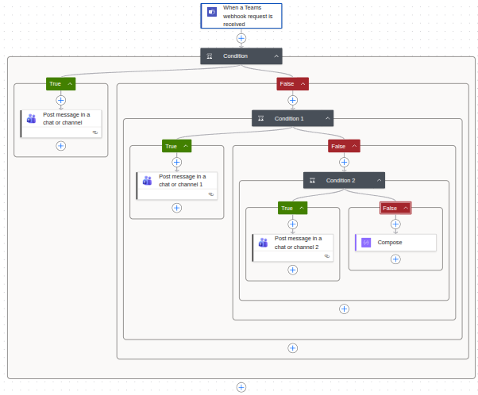

# Power Automate Teams Webhook Workflow

## Overview

This workflow receives HTTP POST requests and routes messages to different Microsoft Teams chats based on a client identifier. It's designed for monitoring systems like Zabbix to send notifications to specific team channels.

## Architecture

The workflow uses nested conditional logic to route messages:
- **Condition 1**: If client = `client_a` → Send to Teams Chat A
- **Condition 2**: If client = `client_b` → Send to Teams Chat B  
- **Condition 3**: If client = `client_c` → Send to Teams Chat C
- **Else**: Return error message for unrecognized client

**Workflow Diagram (Power Automate):**

<p align="center">
  
</p>

**Note:** This workflow requires all Teams chat members to be from the same organization. For chats with external users, use Teams Channels instead (see Limitations section).

## Prerequisites

- Microsoft Power Automate account
- Microsoft Teams access
- Group chats created in Teams for each client
- Workflows app added to each Teams chat
- **Important**: All chat participants must be from the same organization (no federated/external users)

## Step-by-Step Implementation

### Step 1: Create the Workflow

1. Go to [Power Automate](https://make.powerautomate.com)
2. Click **+ Create** → **Instant cloud flow**
3. Name it: `Zabbix-Workflow` (or your preferred name)
4. Search for and select trigger: **When a Teams webhook request is received**
5. Click **Create**

### Step 2: Configure Webhook Trigger

1. In the trigger configuration you'll see:
   - **Who can trigger the flow?**: A dropdown field
   - Select **Anyone** from the dropdown
   
2. Below that, you'll see the **HTTP URL** field which displays the generated webhook URL

3. Save the trigger

4. Copy the **HTTP URL** that appears in the HTTP URL field (you'll need this for sending requests)

**Note:** The "Anyone" option means anyone with the URL can trigger the workflow. The HTTP URL is automatically generated and contains authentication tokens.

### Step 3: Add First Condition (Client A)

1. Click **+ New step**
2. Search for: `Condition`
3. Select **Condition** from Control actions

**Configure the condition:**

**Left field:**
- Click on the field
- Select **Expression** tab
- Enter exactly: `triggerBody()?['client']`
- Click **OK**

**Operator:**
- Select: `is equal to`

**Right field:**
- Type directly (as text): `client_a`

### Step 4: Configure "If Yes" Branch (Client A)

1. Inside the green **If yes** branch, click **Add an action**
2. Search for: `Post message in a chat or channel`
3. Select the Microsoft Teams action
4. Configure:
   - **Post as**: `Flow bot`
   - **Post in**: `Group chat`
   - **Group chat**: Select your "Zabbix Monitoring - Client A" chat
   - **Message**: 
     - Click the field
     - Go to **Expression** tab
     - Enter: `triggerBody()?['full_message']`
     - Click **OK**

### Step 5: Add Second Condition (Client B)

1. Inside the red **If no** branch of the first condition
2. Click **Add an action**
3. Search for: `Condition`
4. Configure:

**Left field:** 
- Expression: `triggerBody()?['client']`

**Operator:** 
- `is equal to`

**Right field:** 
- Text: `client_b`

**Configure "If yes":**
1. Add action → `Post message in a chat or channel`
2. Configure:
   - **Post as**: `Flow bot`
   - **Post in**: `Group chat`
   - **Group chat**: Select "Zabbix Monitoring - Client B"
   - **Message**: Expression `triggerBody()?['full_message']`

### Step 6: Add Third Condition (Client C)

1. Inside the **If no** branch of the second condition
2. Add action → `Condition`
3. Configure:
   - **Left field**: Expression `triggerBody()?['client']`
   - **Operator**: `is equal to`
   - **Right field**: `client_c`

**Configure "If yes":**
1. Add action → `Post message in a chat or channel`
2. Configure:
   - **Group chat**: "Zabbix Monitoring - Client C"
   - **Message**: `triggerBody()?['full_message']`

### Step 7: Error Handling

1. In the **If no** branch of the last condition
2. Add action → Search for: `Compose`
3. Configure:
   - **Inputs**: `Error: Unrecognized client - @{triggerBody()?['client']}`

### Step 8: Save and Test

1. Click **Save** in the top right
2. The workflow is now ready to receive requests

## Usage

### Send a Test Request

```bash
curl -X POST "YOUR_WEBHOOK_URL_HERE" \
  -H "Content-Type: application/json" \
  -d '{
    "client": "client_b",
    "full_message": "Test message from monitoring system"
  }'
```

### Request Format

**Endpoint:** The HTTP URL from Step 2

**Headers:**
```
Content-Type: application/json
```

**Body:**
```json
{
  "client": "client_a|client_b|client_c",
  "full_message": "Your notification message here"
}
```

### Example Requests

**Client A:**
```bash
curl -X POST "YOUR_WEBHOOK_URL" \
  -H "Content-Type: application/json" \
  -d '{
    "client": "client_a",
    "full_message": "High CPU usage detected on server-01"
  }'
```

**Client B:**
```bash
curl -X POST "YOUR_WEBHOOK_URL" \
  -H "Content-Type: application/json" \
  -d '{
    "client": "client_b",
    "full_message": "Backup completed successfully"
  }'
```

**Client C:**
```bash
curl -X POST "YOUR_WEBHOOK_URL" \
  -H "Content-Type: application/json" \
  -d '{
    "client": "client_c",
    "full_message": "Database connection failed"
  }'
```

## Troubleshooting

### Messages Not Appearing in Teams

**Issue:** Message shows literal text `triggerBody()?['full_message']`

**Solution:**
1. Edit the "Post message" action
2. Delete the Message field content
3. Click the lightning bolt icon
4. Select **Expression** tab
5. Enter: `triggerBody()?['full_message']`
6. Click **OK** and Save

### Flow Bot Not in Chat

**Solution:**
1. Open the Teams chat
2. Click **+** (Add a tab)
3. Search for "Workflows"
4. Add the Workflows app to the chat

**Federated Users Error:**

If you see this error:
```
Failed to install the Power Automate app in Microsoft Teams for chat with ID '...' 
Error: ChatAppCUDOperationNotAllowedForFederatedUsers
```

**Cause:** The chat contains users from external organizations (federated users). Microsoft Teams blocks Power Automate installation in these chats for security reasons.

**Solutions:**

1. **Use Channels Instead** (Recommended)
   - Create a Team for your organization
   - Create channels for each client (e.g., "zabbix-client-b")
   - In Power Automate, change the action configuration:
     ```
     Post in: Channel
     Team: [Your Team]
     Channel: [Specific channel]
     ```
   - Channels don't have the same restrictions as group chats with external users

2. **Remove External Users**
   - If possible, create separate chats with only internal users
   - Manually add the Workflows app to these chats

3. **Use Alternative Notification Methods**
   - **Email**: Replace "Post message" action with "Send an email (V2)"
   - **Chat with Flow bot**: Change to `Post in: Chat with Flow bot` (personal notifications only)
   
### Wrong Client Routing

**Solution:**
1. Check the condition expressions have no extra spaces or line breaks
2. Verify the `client` value in your request matches exactly (case-sensitive)
3. Check the Run History in Power Automate to see which path was taken

## Monitoring

### View Run History

1. Go to Power Automate
2. Click on **My flows**
3. Select your workflow
4. Click **Run history**
5. Click on any run to see detailed execution steps

### Check for Errors

- Green checkmark: Step succeeded
- Yellow warning: Warning (may still work)
- Red X: Step failed

## Limitations and Considerations

### Organization Restrictions

**Critical Limitation:** This workflow **only works with group chats that contain users from the same organization**. 

- Group chats with **federated/external users** (users from different organizations) will fail with error: `ChatAppCUDOperationNotAllowedForFederatedUsers`
- This is a Microsoft Teams security restriction that cannot be bypassed
- **Solution**: Use Teams Channels instead of Group Chats (see Troubleshooting section)

### Teams Chat vs. Channels

| Feature | Group Chat | Channel |
|---------|-----------|---------|
| External users | Not supported | Supported |
| Power Automate installation | Requires manual setup | Automatic |
| Best for | Small internal teams | Large teams with external collaborators |
| Recommended for this workflow | No | **Yes** |

### Other Limitations

- Maximum message size: 28KB
- Rate limits: 100 requests per 60 seconds per chat
- Flow bot must be installed before first message
- Requires active Microsoft 365 subscription


## Security Considerations

- The webhook URL contains authentication tokens in the query string
- Keep the URL private and secure
- Consider implementing additional authentication if needed
- The "Anyone" trigger option means anyone with the URL can trigger the flow
- Rotate the URL periodically by regenerating the trigger
- Monitor unauthorized access attempts via Run History

## Extending the Workflow

### Add More Clients

To add a fourth client:
1. Add a new Condition in the last "If no" branch
2. Follow the same pattern as previous conditions
3. Configure the Teams chat for the new client

### Add Logging

Add a "Compose" action after each Teams message:
```
Message sent to Client X at @{utcNow()}
```

### Add Email Notifications

In the error handling branch, add "Send an email" action to notify administrators of unrecognized clients.

## Workflow JSON Structure

The complete workflow follows this structure:

```
Trigger: When a Teams webhook request is received
└── Condition (client == client_a)
    ├── If Yes: Post to Teams Chat A
    └── If No:
        └── Condition (client == client_b)
            ├── If Yes: Post to Teams Chat B
            └── If No:
                └── Condition (client == client_c)
                    ├── If Yes: Post to Teams Chat C
                    └── If No: Compose Error
```

## License

This implementation guide is provided as-is for educational and operational purposes.
